# 서울시 차세대 트렌드 상권 발굴 분석 보고서

> **그림이 안 보일 때 (MD 미리보기)**  
> Cursor·VS Code는 보안상 **로컬 PNG를 미리보기에서 막는 경우**가 많습니다.  
> 1. **`report/최종보고서.html`** 을 탐색기에서 더블클릭 → 브라우저로 열기 (권장)  
> 2. 또는 설정 `markdown.preview.securityLevel` → **`allowLocalFiles`**  
> 3. 이 MD는 반드시 **`report` 폴더 안**에서 열기 (그림 경로: `./images/...`)

**분석 기간** 2020년 ~ 2024년 (분기·연 단위)  
**분석 대상** 서울시 423개 행정동  
**작성 기준** 2026년 5월 분석 결과 (`report/분석_수치_근거.md` 종합)

---

## 요약 (Executive Summary)

본 연구는 서울시 전 행정동을 대상으로 **20대 이동(KT 생활이동)** 과 **20·30대 소비(추정매출)** 를 양축에서 추적하여, 이미 성숙한 트렌드 상권의 전환 패턴을 학습하고 이와 유사하거나 선행 신호를 보이는 **차세대 후보 지역**을 도출하였다.

**핵심 결론은 다음과 같다.**

1. **여가형 이동만이 소비 전환과 연결된다.** 오피스형(주말집중도 &lt; 0.80) 지역에서는 20대 이동비율과 트렌드매출_비중의 상관이 유의하지 않다(r = +0.022). 반면 주거·혼합·상권형에서는 유의한 양의 상관이 확인된다.

2. **레퍼런스 상권은 “이동 선행 → 소비 전환” 패턴을 보인다.** 대표 사례 성수2가1동은 2021년 20대 이동이 먼저 증가한 뒤, 2022년 업종·트렌드 시간대 매출이 급전환되었다. 5년간 20대 매출은 +88.5%로 전체 매출 성장(+49.0%)을 크게 상회한다.

3. **단일 방법론으로는 불완전하다.** 궤적 유사도 분석은 중기·성숙 단계의 “궤적 유사성”을, 이동-소비 사분면 분석은 초기 “이동 모멘텀”을 포착한다. 두 방법의 교집합 **숭인2동·신당5동**이 가장 신뢰도 높은 1순위 후보이다.

4. **임대료는 후행 지표에 가깝다.** 이동·소비 신호 이후 상권 단위 임대료가 반응하는 사례(뚝섬 +51.1%)가 확인되나, 분기 변화량 기준의 단기 선행(lag 1분기)은 약하다. **선행 포착에는 이동·소비 결합이 우선**이다.

---

## 1. 연구 배경 및 목적

### 1.1 배경

서울 상권은 업종 구성, 요일·시간대 매출, 연령대 소비, 유동인구 패턴이 복합적으로 얽혀 변화한다. 특히 “트렌드 상권”은 금요 저녁~주말 중심의 **외부 방문·여가 소비**가 두드러지며, 20·30대의 이동과 소비가 동시에 나타나는 경우가 많다.

그러나 추정매출만으로 상권을 정의하면 **오피스 점심 소비**가 업종점수를 끌어올려, 여가형 트렌드 상권과 혼동될 수 있다. 본 연구는 이동·소비·주말 이용 패턴을 결합해 이 한계를 보완하고, **아직 대중에게 덜 알려진 초기·중기 후보**를 식별하는 것을 목적으로 한다.

### 1.2 연구 가설

| 가설 | 내용 |
|------|------|
| **H1 (이동)** | 차세대 트렌드 상권은 활성화 이전에 **20대 유입**(특히 금요 야간·주말)이 선행 증가한다. |
| **H2 (소비)** | 유입 이후 또는 동시에 **20·30대 매출 비중**과 **트렌드 업종 매출**이 증가한다. |
| **H3 (결합)** | 이동과 소비는 **동시(lag0)** 또는 **1분기 시차(lag1)** 로 함께 움직이며, 임대료 상승은 **이후**에 나타난다. |
| **H4 (변화율)** | KT 데이터의 20대 편향을 고려할 때, **QoQ·YoY·순위 변화**가 절대량보다 식별에 유효하다. |

### 1.3 분석 질문

- 어떤 행정동이 **이미 전환을 마친 레퍼런스 상권**과 구조적으로 유사한가? (궤적 유사도 분석)
- 어떤 행정동이 **이동은 빠르게 늘지만 소비 전환은 아직**인가? (이동-소비 사분면 분석)
- 두 관점을 어떻게 **통합(Tier)** 하여 의사결정에 쓸 수 있는가?

---

## 2. 분석 범위 및 방법

### 2.1 데이터 개요

| 구분 | 내용 | 활용 |
|------|------|------|
| 매출 | 서울시 상권분석서비스 추정매출 (행정동·연도) | 업종점수, 2030비중, 트렌드매출_비중, 금요효과 등 |
| 이동 | KT 생활이동 (행정동·분기) | 20대 유입·이동비율, QoQ·YoY |
| 생활인구 | 서울시 (시간대) | 주말집중도, 구역 유형 분류 |
| 임대료 | 한국부동산원 (상권 64곳) | 전환 이후 부동산 반응 검증 |
| 블로그 | 네이버 검색 API | 외부 인지도 보조 |

**분석 단위**: 423개 행정동 × 2020~2024년. 분기 해상도가 필요한 이동·선행 분석은 분기 시계열을 사용하였다.

### 2.2 핵심 지표 (요약)

**소비 축**

- **업종점수**: (F&B카페 + F&B식사 + 주류·유흥 + 라이프스타일) / 총 매출  
- **트렌드매출_비중**: (금요일×야간비중 + 토·일 매출) / 총 매출 — “금요 저녁~주말” 소비 비중  
- **2030비중**: 20·30대 매출 / 총 매출 (트렌드 상권 **정의**에는 넣지 않고 **사후 검증**에만 사용)

**이동 축**

- **20대 이동비율**: 20대 유입 / 전체 연령 유입  
- **이동성장세점수**(이동-소비 사분면 분석): 장기 증가율·선형 기울기·최근 급등을 z-score 합산

**필터·게이트**

- **주말집중도** = 주말 평균 생활인구 / 평일 평균 생활인구  
- **구역 유형**: 오피스형(&lt;0.80) · 혼합형(0.80~0.95) · 주거형(0.95~1.10) · 상권형(&gt;1.10)  
- **avg22 ≥ 3%**: 2022년 20대 매출 비중이 너무 낮은 동 제외(기저효과 완화)

### 2.3 분석 절차

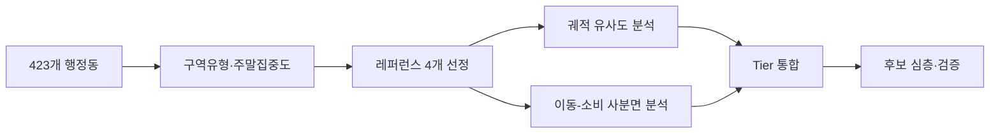
```mermaid
flowchart LR
  A[423개 행정동] --> B[구역유형·주말집중도]
  B --> C[레퍼런스 4개 선정]
  C --> D[궤적 유사도 분석]
  C --> E[이동-소비 사분면 분석]
  D --> F[Tier 통합]
  E --> F
  F --> G[후보 심층·검증]
```

---

## 3. 구역 유형과 레퍼런스 재정의

### 3.1 주말집중도 기반 구역 분류

주말집중도로 423개 동을 네 유형으로 나누면, **오피스형 30개·혼합형 66개·주거형 309개·상권형 11개**이다.

| 구역 유형 | 동 수 | 주말집중도(평균) | 업종점수(2024) | 트렌드매출_비중 | 2030비중 |
|----------|:-----:|:---------------:|:-------------:|:-------------:|:-------:|
| 오피스형 | 30 | 0.691 | **0.580** | 0.256 | 0.302 |
| 혼합형 | 66 | 0.898 | 0.458 | 0.264 | 0.278 |
| 주거형 | 309 | 1.033 | 0.377 | 0.299 | 0.226 |
| 상권형 | 11 | 1.126 | 0.480 | 0.344 | 0.289 |
| **레퍼런스(4)** | 4 | 0.957 | **0.600** | **0.333** | **0.380** |

**해석**: 오피스형은 업종점수가 가장 높지만 트렌드매출_비중은 가장 낮다. 업종점수만으로 “트렌드 상권”을 정의하면 **직장인 점심(FB식사 32.3%)** 이 왜곡을 만든다. 따라서 레퍼런스 선정 시 **주말집중도 ≥ 0.80** 과 **트렌드매출_비중 ≥ 0.30** 을 함께 적용하였다.

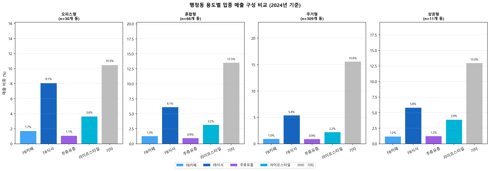  
*그림 1. 구역유형별 트렌드 업종·소비 지표 비교*

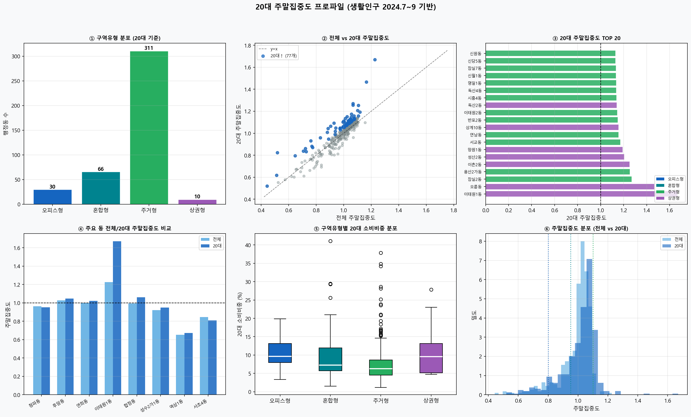  
*그림 2. 주말집중도 분포와 구역 유형 프로파일*

### 3.2 레퍼런스 상권 (확정 4개)

기존 “S1·S2 동시 충족 16개” 목록에서는 **7개가 오피스형**으로 여가형 트렌드와 맞지 않았다. 아래 **4개 동**을 이후 모든 유사도·후보 분석의 기준으로 삼았다.

| 행정동 | 구역 유형 | 주말집중도 | 전환 연도 | 트렌드매출_비중(2024) | 업종점수 | 2030비중 |
|--------|----------|:---------:|:-------:|:-------------------:|:-------:|:-------:|
| 방배2동 | 혼합형 | 0.937 | 2021 | 0.355 | 0.679 | 0.329 |
| 청운효자동 | 주거형 | 0.975 | 2021 | 0.312 | 0.593 | 0.367 |
| 합정동 | 주거형 | 0.993 | 2021 | 0.327 | 0.524 | 0.414 |
| 성수2가1동 | 혼합형 | 0.921 | 2022 | 0.337 | 0.603 | 0.411 |

- **방배·청운효자·합정**: 2021년 전후 업종·2030 지표 충족, 상대적으로 완만한 성장  
- **성수2가1동**: 이동 선행 후 2022년 소비 급전환 — 가설 검증의 **대표 사례**

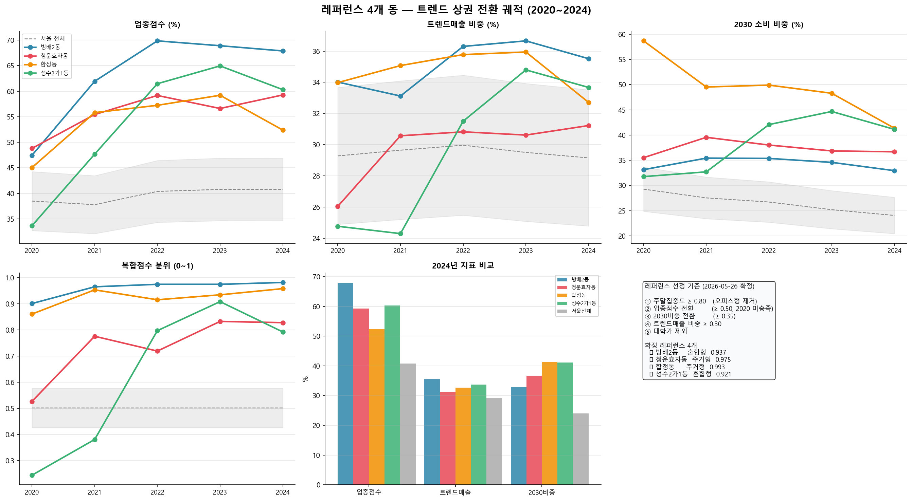  
*그림 3. 레퍼런스·비교군 20대 소비·이동 궤적*

---

## 4. 가설 검증: 이동·소비·임대료

### 4.1 전체 패널: 이동비율과 소비비중

423개 동 × 분기 패널에서 **이동비율 → 20대 매출 비중** 상관은 lag0에서 r = **0.81** (p &lt; 0.001)로 강하다. 다만 **분기 변화량(Δ)** 기준 lag0은 r = **0.18**로, “분기 급등은 동시에 움직이고, 장기적 동행은 수준(level)에서 나타난다”고 해석한다.

| 관계 | 단위 | lag | r (수준) | r (변화량) |
|------|------|:---:|---------:|-----------:|
| 이동비율 → 소비비중 | 분기 | 0 | 0.810 | 0.184 |
| 이동비율 → 소비비중 | 분기 | 1 | 0.810 | −0.041 |
| 이동비율 → 임대료 | 연 | 0~2 | 0.28~0.32 | n.s. |

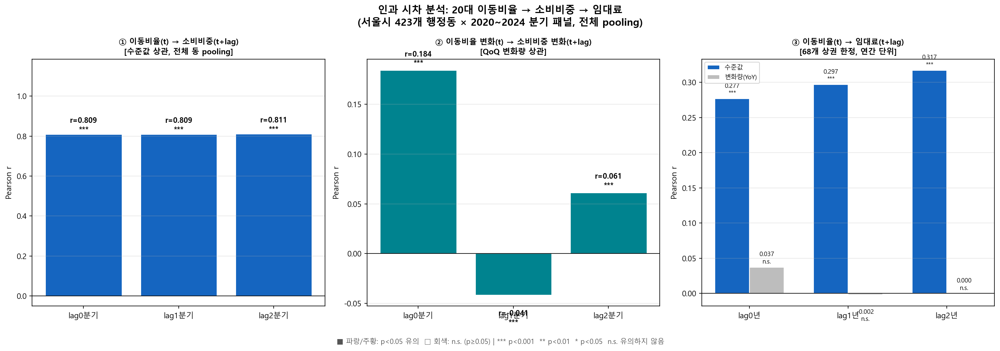  
*그림 4. 이동 ↔ 소비 ↔ 임대료 시차 상관*

### 4.2 QoQ 교차상관 (그룹별)

신규 레퍼런스 4개·궤적 유사도 후보·이동선행 사분면 후보·서울 전체를 나누어 분기 CCF를 산출하였다.

**변화량(Δ) 기준** — lag0에서 동시 상승이 지배적이다.

| 그룹 | lag0 (Δ이동 vs Δ소비) |
|------|:---------------------:|
| 레퍼런스(4) | +0.228* |
| 궤적 유사도 후보(9) | +0.221** |
| 이동선행 사분면 후보(10) | +0.078 |
| 서울 전체 | +0.160*** |

**수준값 기준** — 이동-소비 사분면 후보는 **lag 전 구간에서 r ≈ −0.25** 로, “이동 비율은 높은데 소비 비중은 아직 낮다”는 **이동 선행·소비 미전환** 상태가 수치로 확인된다. 반면 레퍼런스(4)는 lag가 커질수록 상관이 완만히 감소하여, **소비 기반이 먼저 자리 잡고 이동이 따라오는 성숙 구조**에 가깝다.

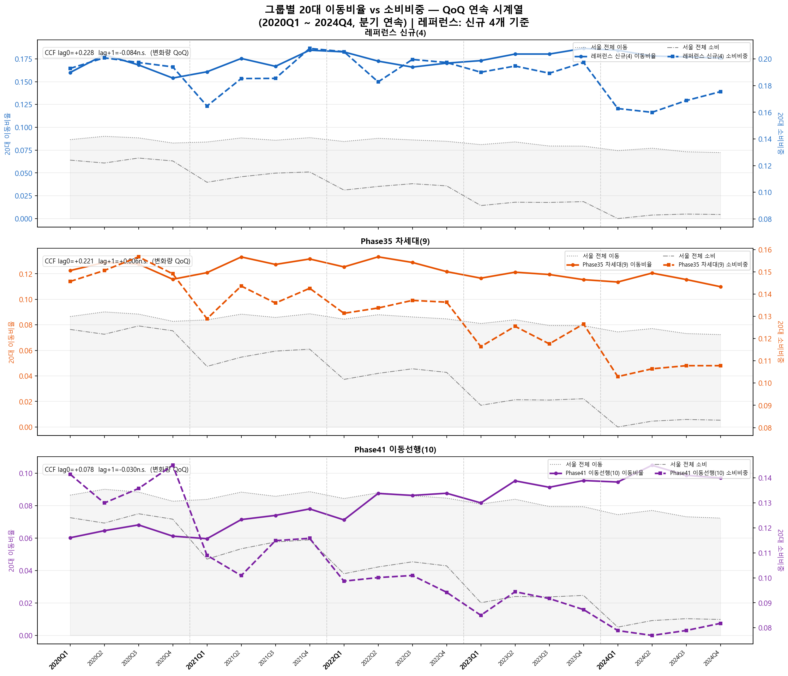  
*그림 5. 그룹별 이동·소비 변화량 시계열*

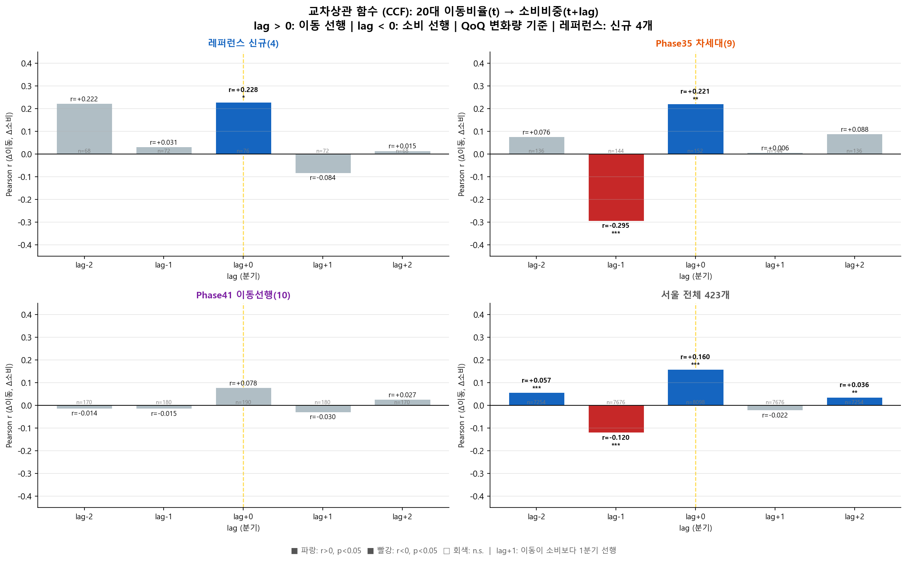  
*그림 6. 그룹별 교차상관 함수*

### 4.3 대표 사례: 성수2가1동

| 연도 | 20대 이동(만) | 20대 이동비율 | 업종점수 | 트렌드매출_비중 |
|------|:------------:|:------------:|:-------:|:-------------:|
| 2020 | 13.1 | 10.7% | 33.7% | 24.8% |
| 2021 | 17.5 | 12.8% | 47.7% | 24.3% |
| **2022** | **29.7** | **17.4%** | **61.5%** | **31.5%** |
| 2023 | 38.5 | 23.5% | 64.9% | 34.8% |
| 2024 | 44.1 | 26.0% | 60.3% | 33.7% |

2021년 이동이 먼저 늘고, 2022년 소비 지표가 급전환되었다. 2020~2024년 **20대 매출 +88.5%**, 전체 매출 +49.0%. 인근 상권 **뚝섬** 임대료는 +51.1%, 공실률 1.7%→3.0%로 수요 압력이 뒤따랐다.

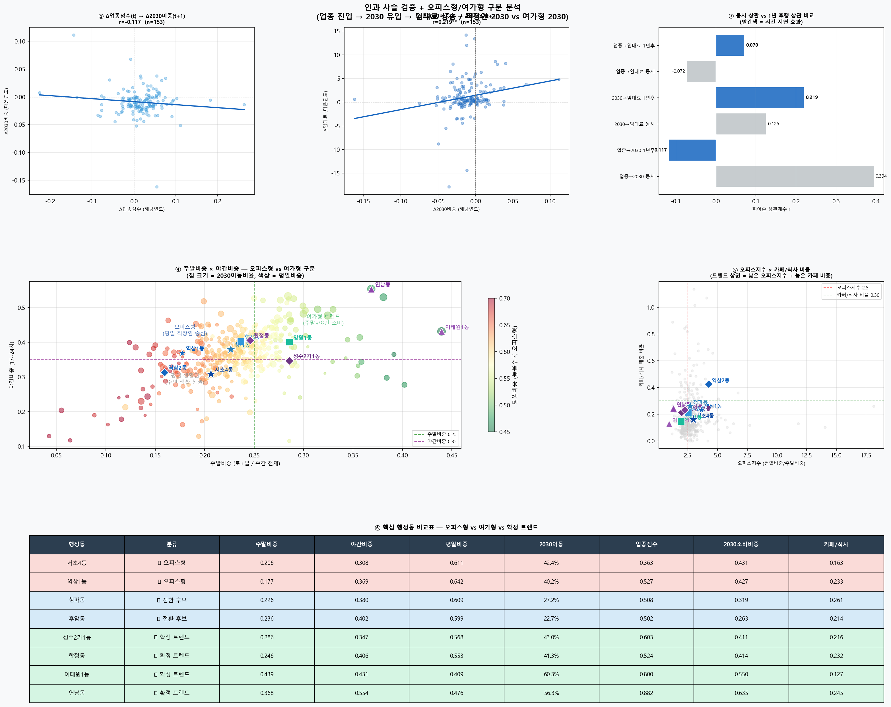  
*그림 7. 이동 → 소비 → 임대료 인과 흐름 (개념·사례)*

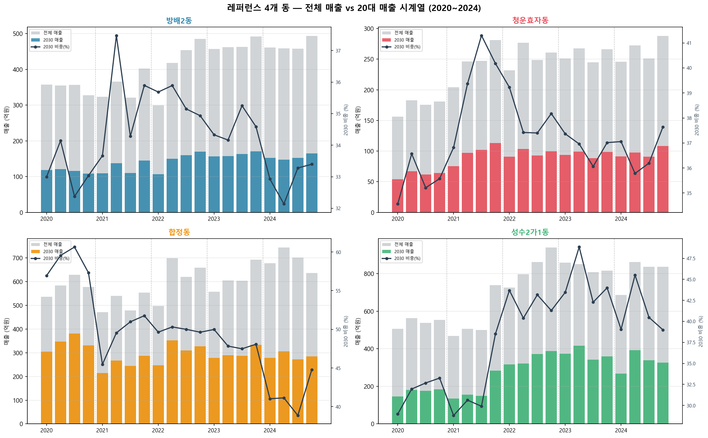  
*그림 8. 레퍼런스 동 매출·업종 시계열*

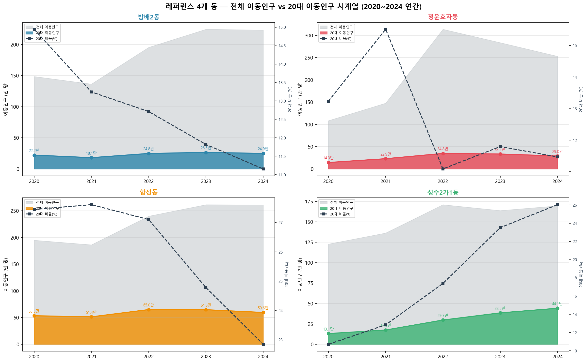  
*그림 9. 레퍼런스 동 20대 이동비율 시계열*

### 4.4 “여가형 이동” 조건

구역 유형별 **20대 이동비율 × 트렌드매출_비중** 상관(패널):

| 구역 유형 | r | 해석 |
|----------|:-:|------|
| 오피스형 | +0.022 (n.s.) | 이동↑ ≠ 소비 전환 |
| 혼합형 | +0.325*** | 유의 |
| 주거형 | +0.433*** | 유의 |
| 상권형 | +0.488*** | 유의 |

**H1·H2는 주거·혼합·상권형에서 성립**하며, 이동-소비 사분면 분석 후보 필터에 **주말집중도 ≥ 0.80** 을 둔 이유를 뒷받침한다.

---

## 5. 차세대 후보 지역 도출

### 5.1 궤적 유사도 분석 — 레퍼런스 궤적 코사인 유사도 (중기·성숙 궤적)

레퍼런스 4개의 5년 궤적(업종점수·트렌드매출_비중·복합점수_분위)을 15차원 벡터로 만들고, 전체 동과 코사인 유사도를 계산하였다.

**TOP 5 (2024 기준)**

| 순위 | 행정동 | 유사도 | 업종점수 | 트렌드매출_비중 | 복합분위 | 구역 유형 |
|:---:|--------|:------:|:-------:|:-------------:|:-------:|----------|
| 1 | **숭인2동** | 0.944 | 0.547 | 0.332 | 0.856 | 주거형 |
| 2 | 가락본동 | 0.934 | 0.529 | 0.296 | 0.780 | 혼합형 |
| 3 | 창4동 | 0.934 | 0.579 | 0.343 | 0.936 | 주거형 |
| 4 | **신당5동** | 0.930 | 0.546 | 0.334 | 0.898 | 주거형 |
| 5 | 석관동 | 0.929 | 0.558 | 0.345 | 0.905 | 주거형 |

Tier2(업종 전환형) 13개 동은 복합분위 평균 **0.829**로 이미 서울 상위권이나, 이동 모멘텀은 상대적으로 약하다.

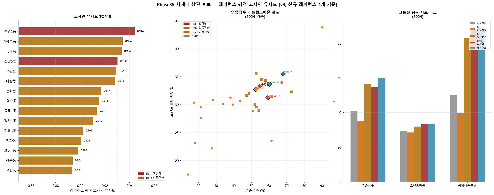  
*그림 10. 궤적 유사도 분석 상위 후보*

### 5.2 이동-소비 사분면 분석 — 4분면 (초기 이동 모멘텀)

- **X축**: 매출 활성도 (20대 매출 규모·비중·YoY)  
- **Y축**: 이동 성장세  
- **유망 후보**: 2사분면(저활성 × 고성장) + avg22 ≥ 3% + 주말집중도 ≥ 0.80  

**이동성장세 상위**

| 행정동 | 이동성장세 | 매출활성도 | 업종점수 | 구역 유형 |
|--------|:---------:|:--------:|:-------:|----------|
| 이촌2동 | **1.738** | −0.426 | 0.140 | 상권형 |
| 신당5동 | 1.174 | −0.045 | 0.546 | 주거형 |
| 오륜동 | 1.123 | −0.030 | 0.902 | 상권형 |
| **숭인2동** | 0.661 | −0.039 | 0.547 | 주거형 |

이동-소비 사분면 후보의 수준 CCF가 음수로 일관되는 것은, 이들이 **”이동은 왔지만 소비 전환은 진행 중”** 인 전형적 초기 단계임을 뜻한다.

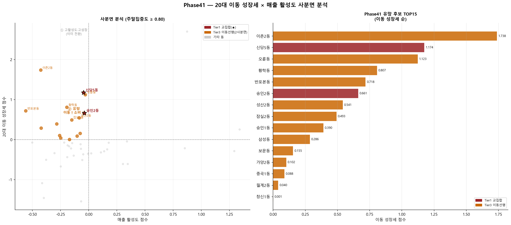  
*그림 11. 이동-소비 사분면 분석 — 매출 활성도 vs 이동 성장세*

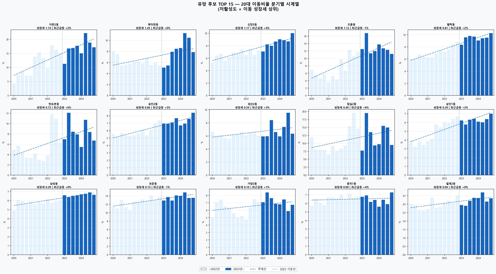  
*그림 12. 2사분면 유망 후보 이동·소비 시계열*

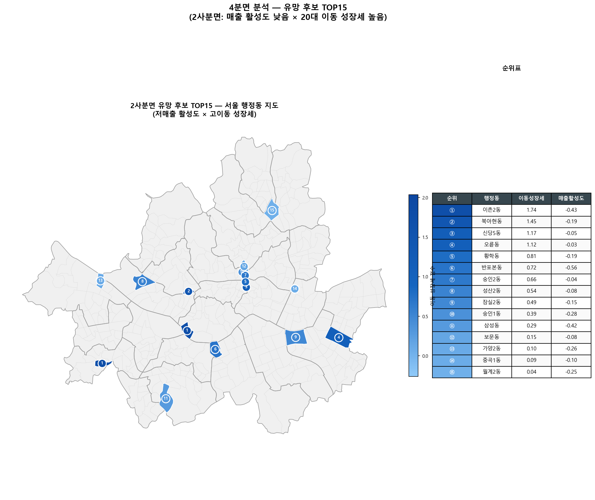  
*그림 13. 후보 행정동 공간 분포*

### 5.3 Tier 통합 및 의사결정 프레임

| Tier | 정의 | 동 수 | 대표 | 의사결정 성격 |
|------|------|:-----:|------|--------------|
| **Tier 1** | 궤적 유사도 ∩ 이동선행 사분면 | **2** | **숭인2동, 신당5동** | 최우선 — 궤적·모멘텀 동시 |
| **Tier 2** | 궤적 유사도 선정 | 13 | 창4동, 청파동, 장위1동… | 중기 — 업종 전환은 진행, 이동은 약함 |
| **Tier 3** | 이동선행 사분면 선정 | 13 | 이촌2동, 황학동, 성산2동… | 초기 — 이동 선행, 소비 미완 |

**2024년 그룹 평균 비교**

| 그룹 | 업종점수 | 트렌드매출_비중 | 2030비중 | 복합분위 |
|------|:-------:|:-------------:|:-------:|:-------:|
| 서울 전체 | 0.407 | 0.291 | 0.241 | 0.501 |
| Tier 3 (이동선행) | 0.349 | 0.285 | 0.212 | 0.398 |
| Tier 2 (업종전환) | 0.564 | 0.319 | 0.257 | 0.829 |
| **Tier 1 (교집합)** | **0.547** | **0.333** | **0.251** | **0.877** |
| 레퍼런스(4) | 0.600 | 0.333 | 0.380 | 0.889 |

Tier 1의 **2030비중(0.251)은 레퍼런스(0.380)보다 낮다**. 업종·이동·복합분위는 레퍼런스에 근접했으나 **“아직 대중 소비·인지도 측면에서 발견 전”** 일 수 있음을 시사한다 — 정책·투자 관점에서 **선점 가치**가 있는 신호이다.

**Tier 1 상세**

| 행정동 | 코사인 유사도 | 이동성장세 | 주말집중도 | 구역 유형 | 20대 이동 Δ(2020→24) |
|--------|:------------:|:---------:|:---------:|----------|:-------------------:|
| 숭인2동 | 0.944 | 0.661 | 1.033 | 주거형 | +113.8% |
| 신당5동 | 0.930 | 1.174 | 1.049 | 주거형 | +146.9% |

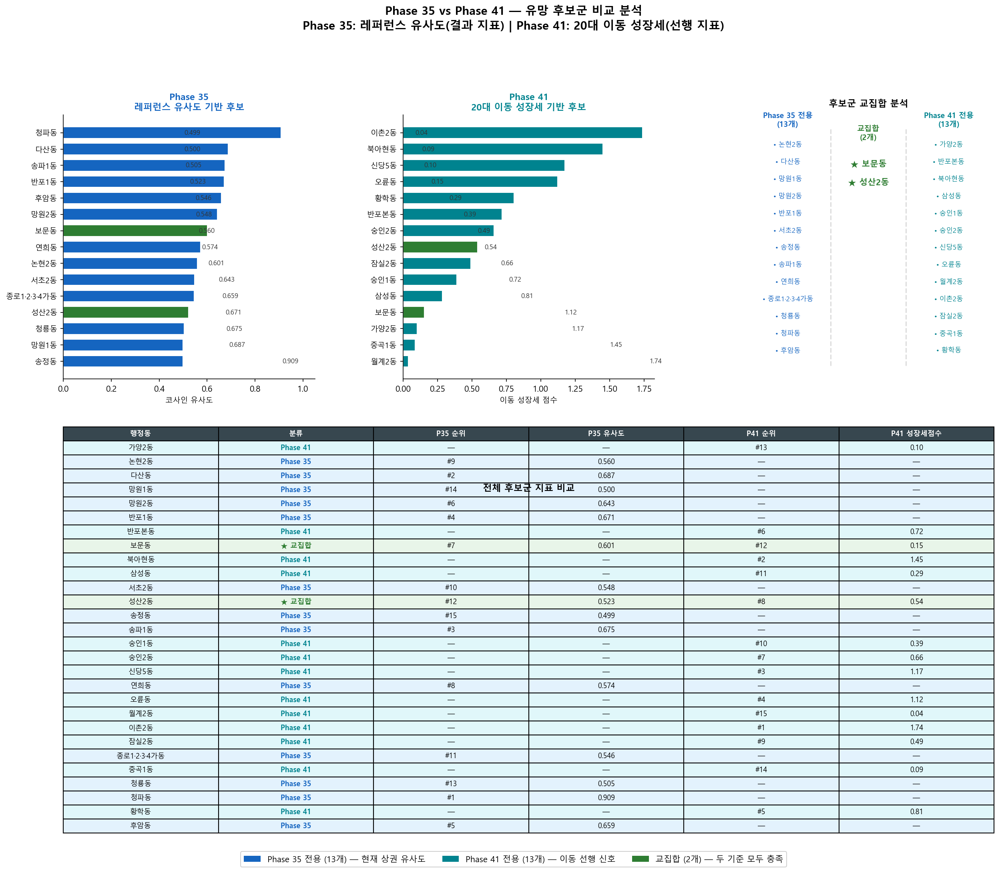  
*그림 14. 두 방법론이 포착하는 상권 생애 단계*

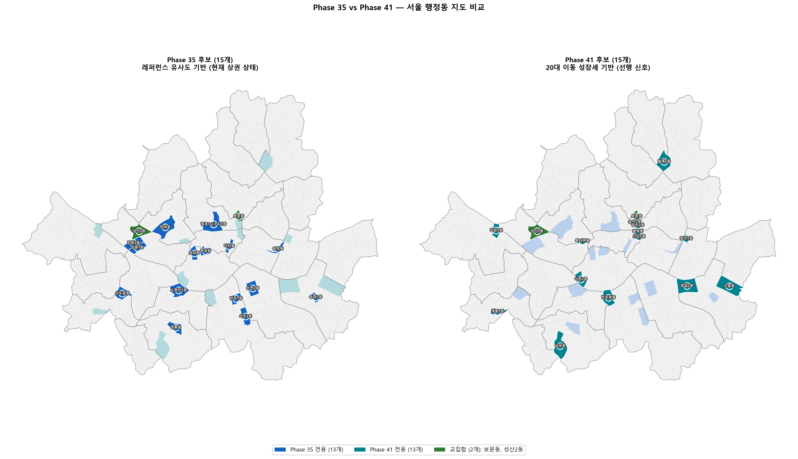  
*그림 15. Tier·방법론별 후보 공간 비교*

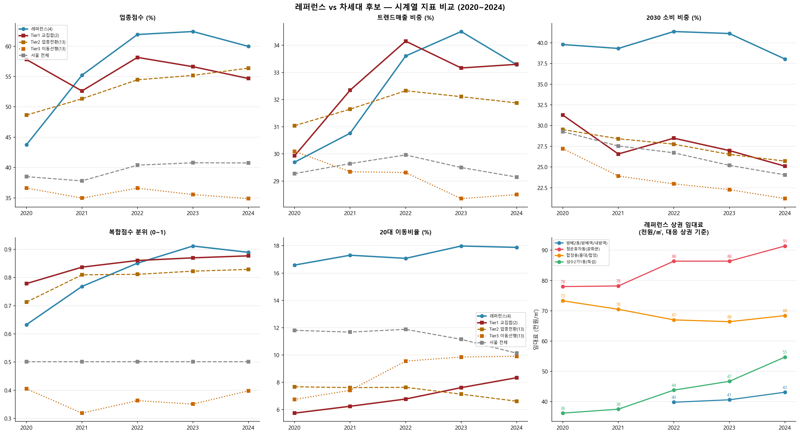  
*그림 16. 레퍼런스 대비 후보 지표 격차*

### 5.4 혼합 활용 권고 (3단계)

1. **광역 스캔 (이동-소비 사분면 분석)**: 이동 모멘텀으로 초기 신호 탐지 — 오피스형·avg22 미달 제외  
2. **궤적 검증 (궤적 유사도 분석)**: 레퍼런스 4개와의 유사도로 중기 적합성 확인  
3. **후처리**: 주말집중도·구역 유형으로 오피스 혼입 차단, Tier별로 모니터링 주기 분리  

---

## 6. 배경 맥락: 서울 20대 소비·이동 추세

보고서 독자를 위한 **전체 맥락** 요약이다.

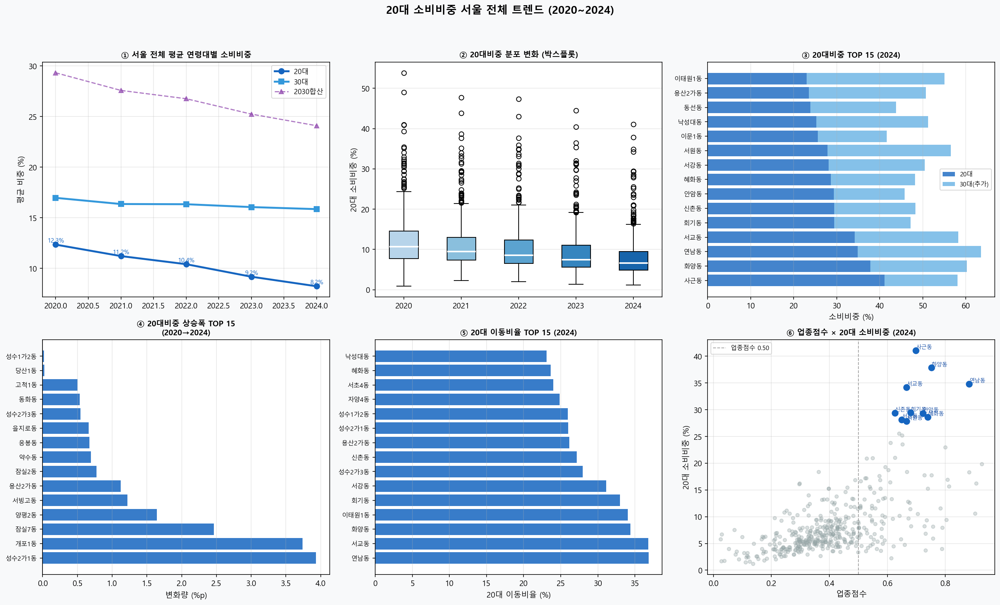  
*그림 17. 서울시 20대 매출 비중 추이*

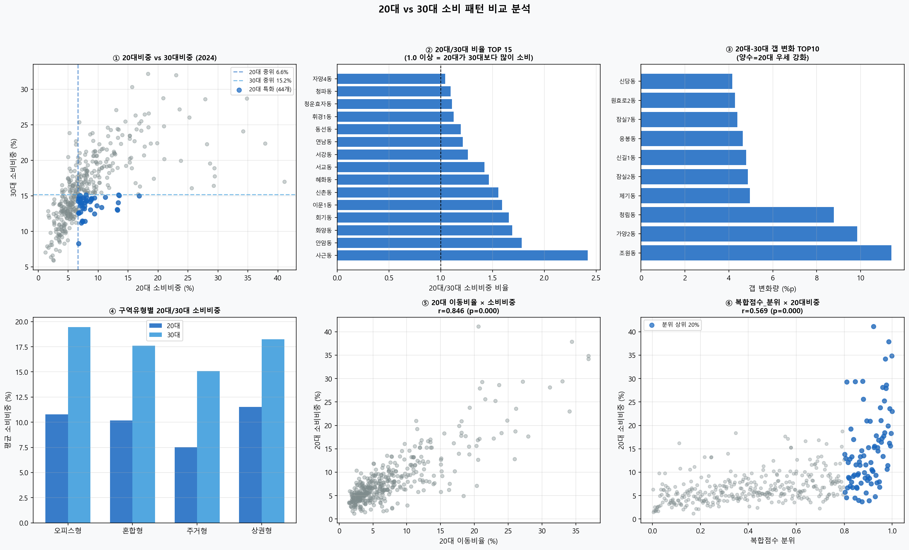  
*그림 18. 20대·30대 소비 구조 비교*

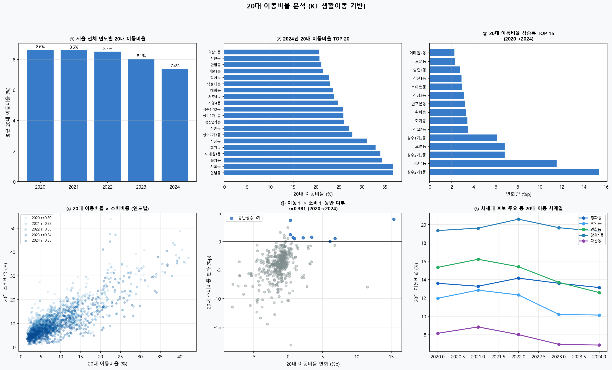  
*그림 19. 20대 이동비율 추이*

레퍼런스 4개 동의 **4년 누적 매출 성장 +35.4%** 는 서울 전체 +25.9% 대비 **+9.5%p** 초과이다. 2022년 +27.4% 급등은 성수2가1동 전환 효과가 주도하였다.

---

## 7. 결론 및 시사점

### 7.1 결론

1. 트렌드 상권의 재현 가능한 전환 경로는 **「여가형 이동 증가 → 트렌드 시간대·업종 매출 전환 → (후행) 임대료 반응」** 으로 요약된다.  
2. **숭인2동·신당5동**은 레퍼런스 궤적과 이동 모멘텀을 동시에 만족하는 **최우선 차세대 후보**이다.  
3. **청파동·창4동** 등 Tier 2는 이미 업종·복합분위가 높아 **중기 안정형** 모니터링에 적합하다.  
4. **이촌2동·황학동** 등 Tier 3는 이동만 강한 **초기 관찰 대상**이며, 소비 전환 여부를 분기 단위로 추적해야 한다.  
5. 단일 지표(업종점수만, 이동만)는 오판 위험이 크며, **주말집중도 게이트 + 이중 방법론**이 신뢰도를 높인다.

### 7.2 실무 시사점

| 대상 | 제안 |
|------|------|
| 상권 분석·지자체 | Tier 1·2를 **정책·홍보 후보군**으로, Tier 3를 **선행 경보군**으로 분리 모니터링 |
| 리테일·F&B 입점 | Tier 1은 레퍼런스 대비 2030비중 갭이 있어 **선점 입점** 여지; 임대료는 인근 상권(44~50천원/㎡) 수준 참고 |
| 데이터 운영 | KT 이동은 **변화율·순위** 중심, 매출은 **트렌드매출_비중** 병행 |

### 7.3 한계

- KT 생활이동의 **20대 회원 편향** — 절대량보다 YoY·QoQ 해석 필요  
- **분기 해상도** — 1분기 선행은 약하고, 연·수준 지속성으로 해석  
- **임대료 64개 상권** — 행정동 후보와 1:1 매칭 불가, 인근 상권으로만 참고  
- **2025년 사후 검증** — 본 보고서 범위 외 (데이터 확보 시 갱신)  
- **외부·언론 교차 검증** — 별도 질적 보고서로 보완 필요  

### 7.4 향후 과제

- Tier 1·2에 대한 **분기 모니터링 대시보드** 고정  
- 청파동·후암동 등 **주거형→상권형** 주말집중도 상승 시점 추적 (전환 확정 신호)  
- 레퍼런스·후보별 **외부 인지도(검색·블로그)** 시차 분석  

---

## 부록 A. 그림 목록

| 번호 | 파일 | 내용 |
|:---:|------|------|
| 1~2 | S2_05, S2_04 | 구역유형·주말집중도 |
| 3~9 | S3_01~S3_08, S3_09~11 | 레퍼런스·인과·QoQ |
| 10~13 | S4a_01, S4b_01~03 | 궤적 유사도·이동-소비 사분면 |
| 14~16 | S5_01~04 | 통합·비교 |
| 17~19 | S2_01~03 | 서울 전체 맥락 |

모든 그림은 `report/images/` 에 있으며, Word·PDF 변환 시 상대 경로 `images/파일명.png` 를 유지하면 된다.

---

## 부록 B. Tier 전체 목록 (28개 동)

### Tier 1 — 교집합 (2)

숭인2동, 신당5동

### Tier 2 — 업종 전환·궤적 유사 (13)

가락본동, 공릉1동, 동화동, 마장동, 석관동, 역촌동, 염리동, 오류1동, 장위1동, 장충동, 정릉3동, 창4동, 청파동

### Tier 3 — 이동 선행·소비 미전환 (13)

가양2동, 반포본동, 보문동, 삼성동, 성산2동, 숭인1동, 오륜동, 월계2동, 이촌2동, 잠실2동, 중곡1동, 창신1동, 황학동

---

*본 문서는 분석 산출물을 보고서 형태로 재구성한 초안이다. 슬라이드·요약본이 필요하면 Executive Summary(요약) 절만 분리해 사용할 수 있다.*
